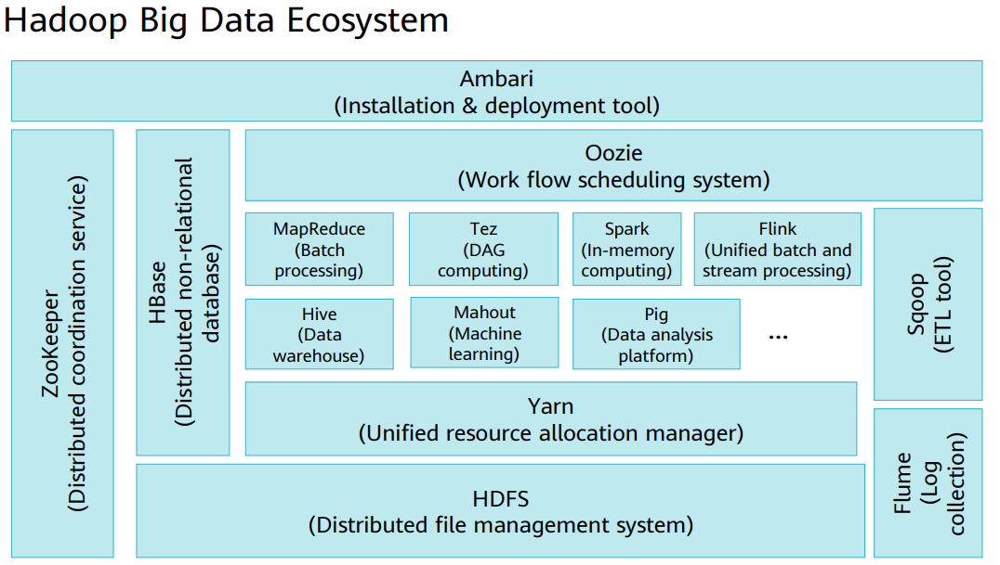

# 🗓️ Day 1 – Big Data Trends & Kunpeng Solutions

**Date:** 2025-07-11  
**Topic:** Introduction to Big Data & Huawei Kunpeng Solutions  
**Certification:** HCIA-Big Data

---

## 📊 What I Learned

### 🔹 Big Data Trends

- **Explosion of data**: Data generated globally is growing exponentially due to IoT, social media, e-commerce, and mobile apps.
- **The 4 Vs of Big Data**:
  - **Volume**: Petabytes of data generated daily.
  - **Velocity**: Real-time data streams (e.g., IoT sensors).
  - **Variety**: Structured (RDBMS), semi-structured (JSON/XML), unstructured (videos, logs).
  - **Value**: Extracting meaningful insights through analytics.

